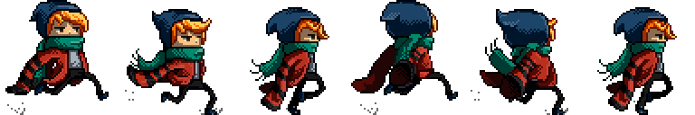

# Dapper Dasher!

A fun side-scrolling 2D runner game built with [raylib](https://www.raylib.com/) in C++. Play as **Scarfy** and jump your way past animated **Nebulae** to reach the finish line!

 <!-- Replace with actual gameplay screenshot if available -->

---

## 🎮 Gameplay Overview

- Press `SPACE` to **jump**.
- Avoid hitting obstacles (nebulae).
- Reach the finish line to **win**.
- If you collide with an enemy, it's **game over**.

---

## 📂 Project Structure

```
DapperDasherGame/
├── .vscode/                  # VSCode settings (optional)
├── textures/                 # Game textures
│   ├── 12_nebula_spritesheet.png
│   ├── back-buildings.png
│   ├── far-buildings.png
│   ├── foreground.png
│   └── scarfy.png
├── dasher.cpp                # Main game source code
├── Makefile                  # For building the game (Linux)
├── .gitignore                # Git ignored files
├── libgcc_s_dw2-1.dll        # Windows runtime dependency
├── libstdc++-6.dll           # Windows runtime dependency
└── main.code-workspace       # VSCode workspace file
```

---

## 🛠️ Build & Run

### 🖥️ Windows

Make sure you have:
- A C++ compiler (like MinGW)
- raylib installed and linked properly
- `.dll` files (already included)

Then run:

```bash
g++ dasher.cpp -o DapperDasher -lraylib -lopengl32 -lgdi32 -lwinmm
./DapperDasher.exe
```

> Adjust paths as needed based on where raylib and your compiler are installed.

---

### 🐧 Linux

If you're on Linux and `Makefile` is set up correctly:

```bash
make
./DapperDasher
```

> Make sure raylib is installed via your package manager or manually.

---

## 🧠 Features

- Character and enemy animations using sprite sheets
- Gravity-based jump physics
- Parallax background with 3 depth layers
- Basic win/lose game state logic
- Simple collision detection using rectangles

---

## ⌨️ Controls

| Key     | Action     |
|---------|------------|
| `SPACE` | Jump       |
| `ESC`   | Exit Game  |

---

## 📌 Notes

- The game runs at a fixed **50 FPS**.
- You can tweak difficulty by modifying:
  - `nebulaeSize`
  - `gravity`
  - `jumpVel`
  - `nebVel`

---

## 🚀 Future Improvements

- Add scoring system
- Include background music and jump sound
- Create a main menu and restart option
- Add more obstacles or power-ups
- Export to Web using Emscripten (raylib supports it)

---

## 📜 License

This game is open-source and free to use for personal or educational purposes. Feel free to fork and modify!

---

### 👏 Made with 💖 and raylib.
